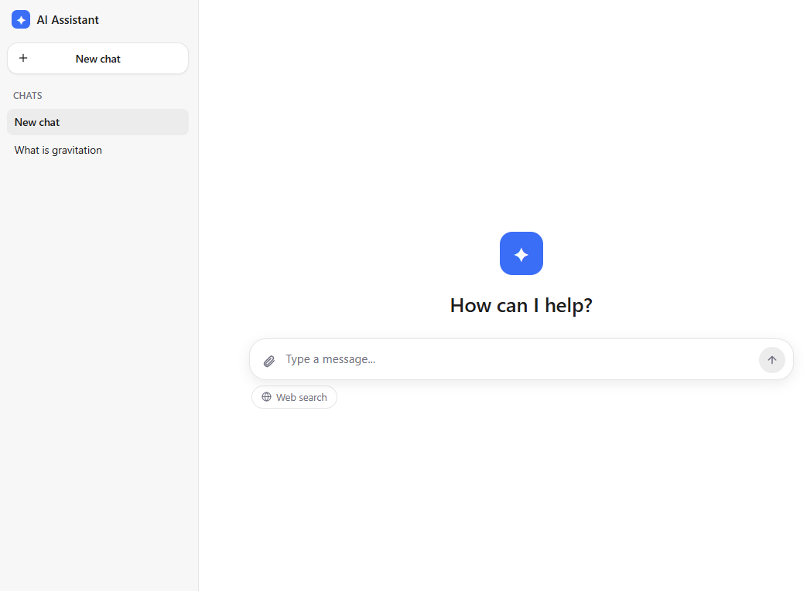
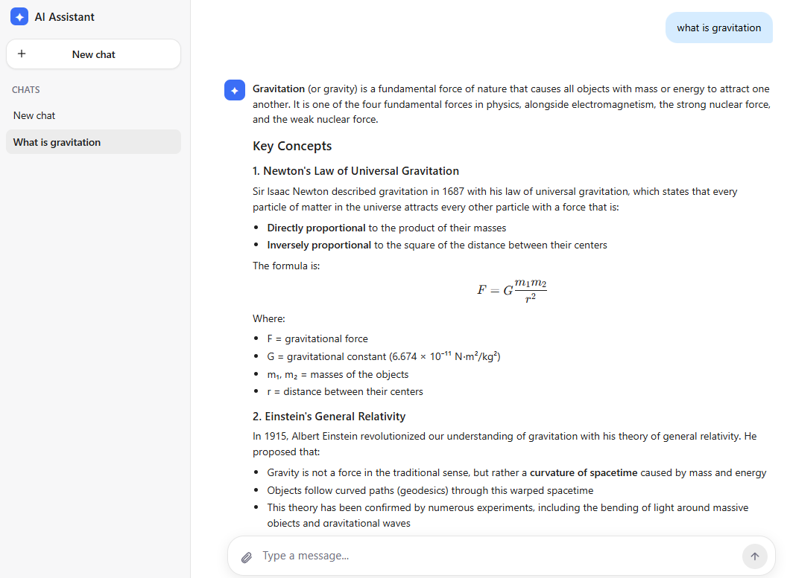

# LLM UI light

A chat assistant on top of your own self-hosted LLM server: FastAPI backend and Vue 3 frontend.
Supports streaming responses, model tool-calling (web search out of the box, easy to extend with
your own tools), document uploads (PDF/DOCX/XLSX) for the model to reason over, and login either
via an SSO redirect or a direct email+password sign-in/registration form.

The project targets self-hosting by a single person or a small team — no GPU, no complex
infrastructure required. The UI supports English and Russian, with a toggle in the sidebar and
English as the default; see "Language" below for details.

## Screenshots

<p>
  
  
</p>

## Features

- Streaming chat on top of any OpenAI-compatible LLM server (vLLM, llama.cpp server,
  text-generation-webui, etc.) — just point it at `LOCAL_LLM_URL`.
- Web search as a model tool call (via a self-hosted SearXNG instance, falling back to `ddgs`),
  including a forced-search toggle in the UI.
- File uploads in chat: text is extracted from PDF (text-layer only), DOCX, and XLSX with no
  ML/GPU dependencies — just `pypdfium2`/`python-docx`/`openpyxl`. Scanned documents or files with
  no text layer aren't recognized (there's no OCR) — a deliberate tradeoff for a lightweight,
  GPU-free deployment.
- Conversation history is stored server-side (SQLite out of the box, easily switched to
  Postgres).
- Two login paths: an external system links to `/api/sso?email=...` and the user gets a session by
  email with no password (see "Security model" below — this is **not** full authentication), or,
  when the site is opened directly with no such link, a plain email+password sign-in/registration
  form (`POST /api/register`, `POST /api/login/password`) shown by the frontend itself.

## Quick start (Docker Compose)

```bash
cp .env.example .env
# edit .env — make sure to fill in LOCAL_LLM_URL, LLM_MODEL_NAME, SSO_SECRET_KEY
docker compose up --build
```

This brings up: `postgres`, `searxng` (metasearch for web search), `backend` (:8010), `frontend`
(:8501 by default, see `FRONTEND_PORT`).

Open `http://localhost:8501` — login happens via `GET http://localhost:8010/api/sso?email=you@example.com`
(in production this should be a link from your corporate SSO system/portal, see below).

### Required environment variables

| Variable | Used by | Description |
|---|---|---|
| `LOCAL_LLM_URL` | backend | Base URL of your OpenAI-compatible LLM server |
| `LLM_MODEL_NAME` | backend | Model name sent in requests to the LLM server |
| `SSO_SECRET_KEY` | backend | Key used to encrypt the email in the SSO redirect. Generate with: `openssl rand -hex 32` |
| `REDIRECT_URL` | backend | Where `/api/sso` redirects after encrypting the email (usually the frontend's address) |
| `LOCAL_STORAGE_HOST_PATH` | docker-compose | Host directory for uploaded files/cache/history |

The full list of optional variables is in `.env.example` (repo root), with comments describing
each one, mirrored by `backend/.env.example`-style settings.

## Running without Docker (development)

Details are in `backend/README.md`; in short:

```bash
# backend
cd backend
pip install -r requirements.txt
# create backend/.env with LOCAL_STORAGE, LOCAL_LLM_URL, MODEL_NAME, REDIRECT_URL, SSO_SECRET_KEY
uvicorn main:app --host 0.0.0.0 --port 8010

# frontend (in a separate terminal)
cd frontend
npm install
cp .env.example .env   # adjust VITE_API_BASE_URL if needed
npm run dev
```

## Security model (important — please read)

`/api/sso?email=...` **trusts the email from the query parameter with no signature or password
verification whatsoever**. This is a deliberate simplification for internal/trusted use: it
assumes your own SSO/reverse-proxy/VPN already sits in front of this service and has authenticated
the user, and that the `/api/sso?email=...` link is generated by that trusted layer rather than
typed by the user directly. **Do not expose `/api/sso` directly to the open internet** without an
additional authentication layer in front of it — as it stands, anyone who can reach this endpoint
can log in as any email address.

`SSO_SECRET_KEY` is required and has no default specifically for this reason — the app won't
start without it, so a forked/deployed copy can't be left running on a publicly known key.

If you'd rather not expose `/api/sso` at all, the frontend's login screen also offers a direct
email+password sign-in/registration form (backed by `POST /api/register` and
`POST /api/login/password`) — passwords are hashed (`backend/security.py`, stdlib
`hashlib.pbkdf2_hmac`, no third-party crypto dependency) and checked only at login time. Once
logged in either way, the rest of the app treats the session identically: the frontend just holds
the plain email and sends it as `X-User-Email` on every request (see `CLAUDE.md`'s "Auth" section
for the full flow), so this is still a low-security-bar, self-hosted/internal design rather than a
hardened multi-tenant auth system.

## Architecture

A detailed description of the project structure, data flows, and internal design decisions lives
in [`CLAUDE.md`](CLAUDE.md) (originally written as context for Claude Code, but it remains an
accurate technical description of the architecture for humans too).

## Language

The frontend UI is bilingual (English and Russian) via a small hand-rolled i18n layer
(`frontend/src/i18n/`, no external dependency), with a toggle button in the sidebar
(`ConversationSidebar.vue`) and English as the default. The choice persists in `localStorage`.
The backend's LLM system prompt (`build_system_prompt()` in `backend/main.py`) is written in
English and instructs the model to reply in English unless the user asks for another language —
this is independent of the frontend's UI locale toggle, so switching the UI to Russian does not by
itself make the assistant reply in Russian. See [`CONTRIBUTING.md`](CONTRIBUTING.md) for how this
affects contributions.

## License

[MIT](LICENSE).

## Contributing

See [`CONTRIBUTING.md`](CONTRIBUTING.md).
